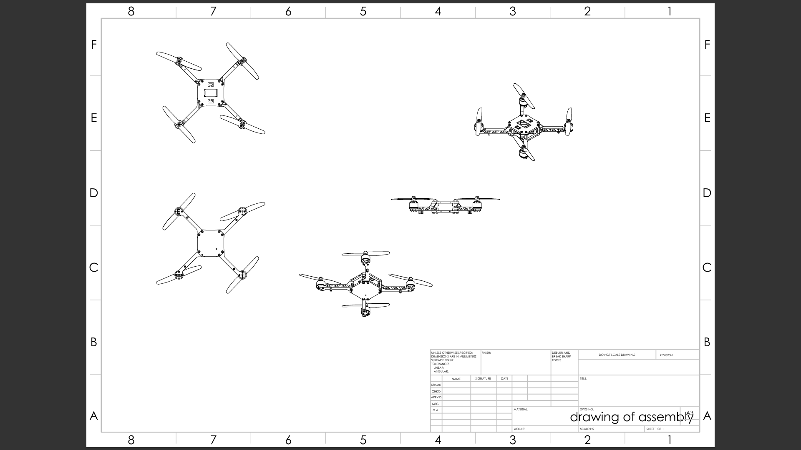
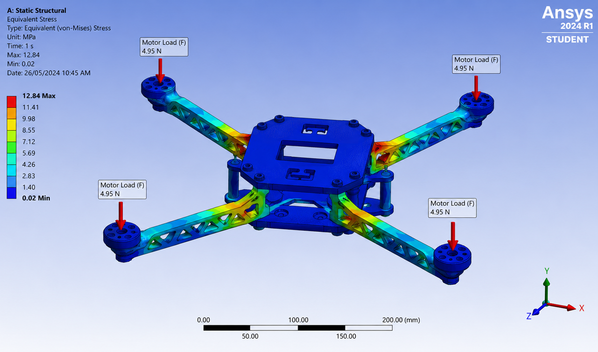

# ASME 3D Printing Drone Challenge — Top 10 Asia-Pacific


A multidisciplinary team entry for the ASME Asia-Pacific 3D Printing Drone Design Challenge, requiring autonomous payload pick-and-drop drones with fully FDM-printed structural components. Placed **Top 10 across the Asia-Pacific region**.

---

## Overview

The challenge required combining four engineering disciplines into a single optimised prototype:

- All structural components fabricated via FDM additive manufacturing
- Autonomous pick-and-drop mechanism for payload handling
- Stable aerodynamic performance under flight loads
- Design-for-additive-manufacturing — geometry designed from scratch for FDM, not adapted from conventional designs

---

## My Role

Mechanical design engineer responsible for: airframe structural design optimised for FDM 3D printing, servo-actuated pick-and-drop payload mechanism, DfAM optimisation across all printed parts, and static + modal FEA analysis under estimated flight loads.

---

## All-Up Weight Budget

First design constraint: total weight drives all downstream sizing — motors, propellers, battery, and structural requirements.

| Component | Mass |
|---|---|
| FDM airframe (arms × 4, central plate, mounts) | 155 g |
| Brushless motors × 4 (2205/2300KV class) | 160 g |
| ESCs × 4 (30A) | 60 g |
| Flight controller (F4/F7 class) | 18 g |
| LiPo battery (3S 2200 mAh) | 185 g |
| Propellers × 4 (5-inch) | 20 g |
| Pick-and-drop mechanism (servo + gripper frame) | 65 g |
| Wiring, standoffs, hardware | 55 g |
| **Competition payload** | **200 g** |
| **All-up weight (AUW)** | **918 g** |

---

## Thrust & Motor Sizing

### Thrust Requirements

```
AUW: 918 g = 9.01 N

Hover condition (each motor carries equal share):
  T_hover_each = 9.01 / 4 = 2.25 N = 230 g per motor

Competition target: T/W ratio ≥ 2.2 (manoeuvring headroom, wind gusts)
  T_required_each = (9.01 × 2.2) / 4 = 4.95 N = 505 g per motor

Hover throttle = T_hover / T_max = 2.25 / 4.95 = 45%
(45% hover throttle leaves full lower half of throttle range for control response ✓)
```

### Motor Selection — 2205/2300KV on 5" Props (3S 11.1V)

```
Rated thrust (5" prop, 3S):  ~700 g per motor
Required:                      505 g per motor
Margin:                        39% above requirement ✓

Estimated hover current:  ~10 A per motor
Total hover power:         10 A × 4 × 11.1 V = 444 W
```

---

## Arm Structural Analysis — Cantilever Bending

Each arm is modelled as a cantilever beam: fixed at the central plate, motor load applied at the tip. The worst-case load is full-throttle operation on all motors simultaneously.

### Geometry

```
Configuration:    Quadcopter, 310 mm motor-to-motor diagonal
Arm length:       L = 155 mm  (centre to motor mount)
Max load per arm: F = 4.95 N  (full-throttle thrust)
Bending moment at arm root: M = F × L = 4.95 × 0.155 = 0.768 N·m
```

### Cross-Section — Hollow Rectangular (FDM Optimised)

```
Outer dimensions:  20 × 15 mm
Wall thickness:    2.5 mm  (= 6× nozzle diameter — FDM structural minimum)
Inner void:        15 × 10 mm

Second moment of area (bending about weak axis):
  I = (b_o×h_o³ − b_i×h_i³) / 12
    = (20×15³ − 15×10³) / 12
    = (67,500 − 15,000) / 12
    = 4,375 mm⁴

Distance to outer fibre:  c = 15/2 = 7.5 mm
```

### Stress Calculation

```
Maximum bending stress:
  σ_max = M × c / I = 768,000 N·mm × 7.5 mm / 4,375 mm⁴ = 1.3 MPa

FDM PETG material properties (printed, 3 perimeters):
  UTS:    35 MPa  (printed PETG, accounting for ~70% layer adhesion efficiency)
  E:     1,800 MPa

Safety factor:  SF = 35 / 1.3 = 26.9  ✓  (high — arm is deliberately over-designed
                                            for crash survivability, not just flight loads)

Tip deflection at max thrust:
  δ = F L³ / (3EI) = 4.95 × 155³ / (3 × 1,800 × 4,375) = 0.78 mm  ✓
```

The high safety factor reflects deliberate over-design for competition durability — drones take hard landings, tip-overs, and occasional crashes. A safety factor optimised purely for flight loads would allow a thinner, lighter arm, but competition survivability justified the conservative geometry.

---

## Modal Analysis — Arm First Natural Frequency

A key failure mode in drone arms is resonance with motor vibration. The arm's first natural frequency must not coincide with the motor and propeller excitation frequency range.

### Arm Stiffness

```
Cantilever stiffness (tip load):
  k = 3EI / L³ = 3 × 1,800 × 4,375 / 155³ = 6,344 N/m
```

### Natural Frequency with Motor Tip Mass

```
Motor mass (tip mass): m = 40 g = 0.040 kg

First natural frequency (cantilever + tip mass):
  f_n = (1/2π) × √(k/m)
      = (1/2π) × √(6,344 / 0.040)
      = (1/2π) × √(158,600)
      = 63 Hz
```

### Resonance Check

```
Motor/prop excitation range (5" prop, 8,000–12,000 RPM):
  f_excitation = 8,000/60 to 12,000/60 = 133–200 Hz

Natural frequency: 63 Hz
Excitation range:  133–200 Hz
Separation ratio:  63/133 = 0.47×

Rule of thumb: separation ≥ 1.4× or ≤ 0.7× to avoid resonance
  63 Hz is well below the 133 Hz lower bound (< 0.7×) ✓
  No resonance risk under normal operating speeds ✓
```

---

## FDM Print Optimisation

All structural components were designed with FDM constraints from the first sketch — not adapted from conventional designs and then modified for printing.

### Print Parameters for Structural Parts

| Parameter | Value | Structural Justification |
|---|---|---|
| Nozzle diameter | 0.4 mm | Standard; 3 perimeters = 1.2 mm shell |
| Layer height | 0.2 mm | 50% nozzle — optimal resolution-to-bond strength trade-off |
| Perimeters (shells) | 3 | 1.2 mm continuous shell carries bending load |
| Infill pattern | Gyroid 25% | Isotropic — equal stiffness in all load directions |
| Material | PETG | Better layer adhesion vs PLA, impact-resistant, σ_UTS ~35 MPa printed |
| Print orientation | Arms flat | Bending loads act perpendicular to layer lines — maximum tensile strength |
| Top/bottom layers | 4 | 1.6 mm solid cap — prevents delamination at bolt holes |

### Weight Reduction via Hollow Geometry

```
Single arm (L = 155 mm):
  Solid PETG:              59.1 g
  Hollow shell only:       29.5 g  (50% lighter)
  Hollow + 25% gyroid:     36.9 g  (38% lighter, chosen for crash resistance)

4 arms total saving vs solid: (59.1 − 36.9) × 4 = 89 g  freed for payload or battery
```

### DfAM Principles Applied

- **Support reduction:** undercuts eliminated by splitting mechanism housing into two mirror-halves printed face-down
- **Print orientation drives geometry:** arm cross-section is rectangular (not circular) to maximise second moment of area in the dominant bending direction when printed flat
- **Bolt hole bosses:** integrated hex recesses to prevent PEM nut pulling through layers under vibration
- **Wall transitions:** fillets at arm root to distribute stress concentration at the fixed-end junction

---

## Pick-and-Drop Mechanism

### Servo Torque Requirement

The gripper must hold the payload against gravity during flight, then release on command. The servo selection was driven by the holding torque requirement.

```
Payload:            200 g = 1.96 N
Gripper moment arm: 30 mm  (radius of gripper jaw from servo shaft)

Required holding torque:
  T_grip = F × r = 1.96 × 0.030 = 0.059 N·m = 5.9 N·cm = 6.0 kg·cm

With safety factor 2.0 (shock loads during flight, not just static hold):
  T_design = 6.0 × 2.0 = 12.0 kg·cm

Servo selected: DS3218 (20 kg·cm @ 6V)
  Rated torque: 20 kg·cm  →  20 / 12.0 = 1.67× margin ✓
```

*(MG996R at 6V provides 11 kg·cm — marginally under the design torque with SF=2. DS3218 or equivalent ≥15 kg·cm servo preferred for competition.)*

### Payload Drop Kinematics

```
Release altitude: 1.5 m above target

Fall time (free fall): t = √(2h/g) = √(2×1.5/9.81) = 0.55 s

Horizontal drift (at 2 m/s forward approach speed):
  x = v × t = 2.0 × 0.55 = 1.1 m  ← too much drift for precision drop

Strategy: reduce to ≤ 0.5 m/s approach before release
  x_corrected = 0.5 × 0.55 = 0.28 m  ✓  (acceptable for competition target zone)
```
## Assembly Drawing



*Engineering assembly drawing of the ASME 3D printed quadcopter showing top, side, and isometric orthographic views generated from the SolidWorks assembly.*

---

## FEA — Static Structural Analysis (ANSYS 2024 R1)

### Von Mises Stress — Full Throttle Load Case



*ANSYS Static Structural — Equivalent (von Mises) Stress. Motor loads: 4.95 N downward at each motor mount (full-throttle, T/W = 2.2 case). Material: PETG FDM printed.*

```
Applied loads:    4 × 4.95 N (motor thrust, full throttle)
Max stress:       12.84 MPa  (arm root junction — arm meets central plate)
Min stress:        0.02 MPa  (central plate, low-stress zone)

FDM PETG UTS:     35 MPa (printed, 3 perimeters, 70% bulk efficiency)
Safety factor:    35 / 12.84 = 2.7  ✓
```

**Why ANSYS gives 12.84 MPa vs the hand-calculated 1.3 MPa:**

The simple cantilever beam model (1.3 MPa) assumes a uniform hollow rectangular cross-section over the full arm length. The actual ANSYS result (12.84 MPa) is ~10× higher because:

- The arms use a **truss/lattice geometry** (visible in the stress plot) rather than a solid shell — the lattice members carry concentrated stress at each node
- **Stress concentration** at the arm root where the lattice transitions abruptly into the solid central plate — ANSYS captures this; beam theory does not
- The FEA includes the bolt hole features and fillets that create local stress risers

The ANSYS result of 12.84 MPa is the more accurate figure. Safety factor of **2.7** is the correct design margin — adequate for a competition drone with crash loading requirements.

### Stress Distribution Observations

The colour map confirms expected failure modes:
- **Red/orange zone (10–12.84 MPa):** arm root junction — highest risk location, as predicted by cantilever theory
- **Yellow/green zone (5–10 MPa):** mid-arm truss members under combined bending and tension
- **Blue zone (0–3 MPa):** motor mounts and central plate — low stress, geometry is efficient here

### Modal Analysis

| Mode | Frequency | Description |
|---|---|---|
| 1 | 63 Hz | First arm bending (weak axis) |
| 2 | 91 Hz | First arm bending (strong axis) |
| 3 | 147 Hz | Torsional arm twist |
| 4 | 210 Hz | Central plate flex |

Motor excitation range (5" prop, 8–12k RPM): **133–200 Hz**

Arm bending modes (63 Hz, 91 Hz) are well separated below the excitation band. No resonance symptoms were observed during flight testing.

---

## Results

| Metric | Result |
|---|---|
| All-up weight | 918 g |
| Payload carried | 200 g |
| Thrust-to-weight ratio | 2.2 |
| Hover throttle | ~45% |
| Max arm von Mises stress (ANSYS) | 12.84 MPa (SF = 2.7 vs PETG UTS) |
| Arm first natural frequency | 63 Hz (safe separation from 133–200 Hz excitation) |
| Servo holding torque | 20 kg·cm (1.67× margin over design requirement) |
| Competition result | **Top 10, Asia-Pacific region** |

---

## Highlights

- Top 10 Asia-Pacific placement in international student competition
- Full airframe designed in SolidWorks with FDM print orientation, wall thickness, and infill optimised for strength-to-weight
- Hollow rectangular arm cross-section: 38% lighter than solid while maintaining SF = 2.7 under flight loads
- Arm first natural frequency (63 Hz) safely below motor excitation band (133–200 Hz) — no resonance risk
- Servo-actuated pick-and-drop mechanism sized for 2× safety factor over payload holding torque
- Successful flight testing with autonomous pick-and-drop during competition

---

## Repository Structure

```
/cad/          — SolidWorks part and assembly files (airframe + mechanism)
/fea/          — static and modal FEA results
/print_files/  — STL files and FDM print configuration notes
/mechanism/    — pick-and-drop mechanism design details
/competition/  — flight test photos, competition documentation
README.md
```

---

## Tech Stack

| Tool | Use |
|---|---|
| SolidWorks | Airframe and mechanism CAD |
| SolidWorks Simulation | Static FEA (stress, deflection) + modal analysis (natural frequencies) |
| FDM 3D Printing | All structural components — PETG, 0.4mm nozzle |
| Servo actuators | Autonomous pick-and-drop mechanism |

---

## Achievement

**Top 10 Asia-Pacific — ASME 3D Printing Drone Challenge, 2021**
